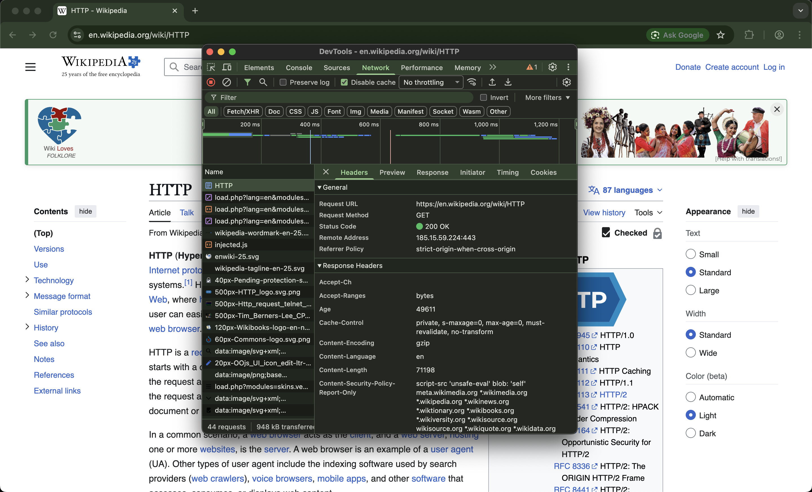
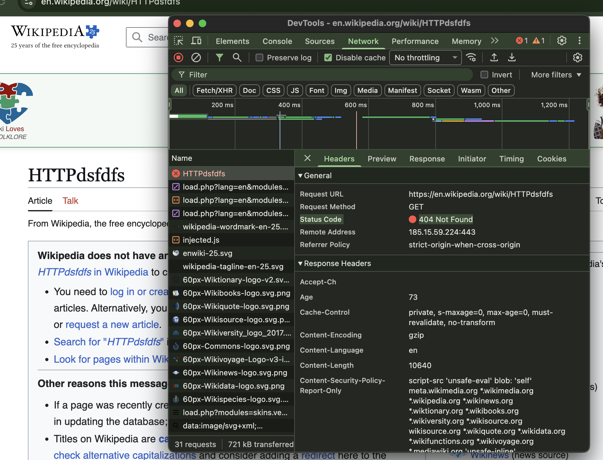
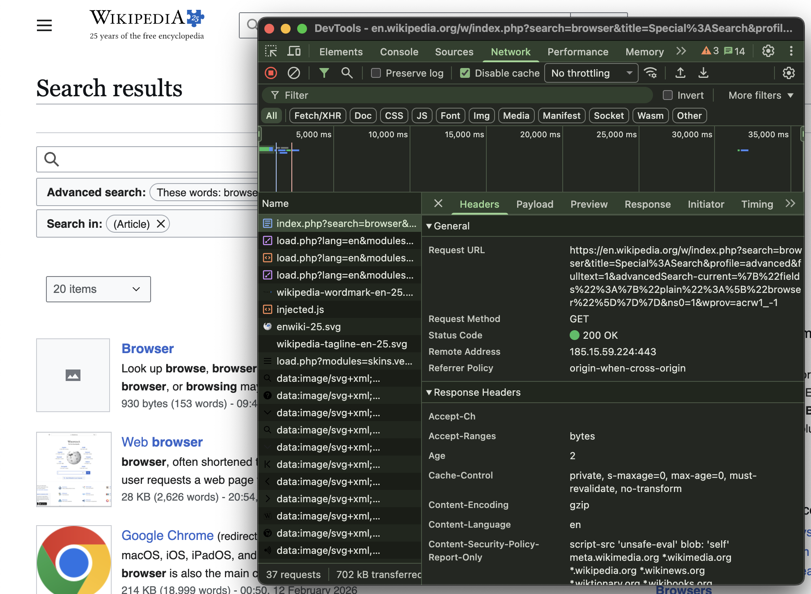
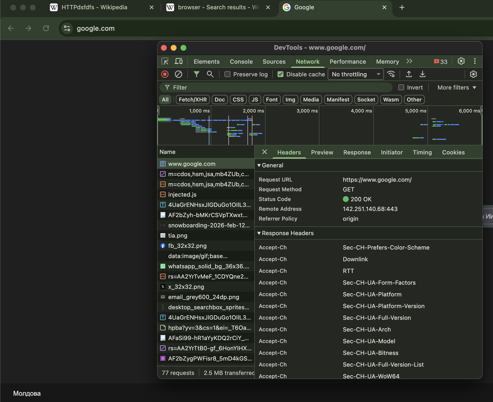
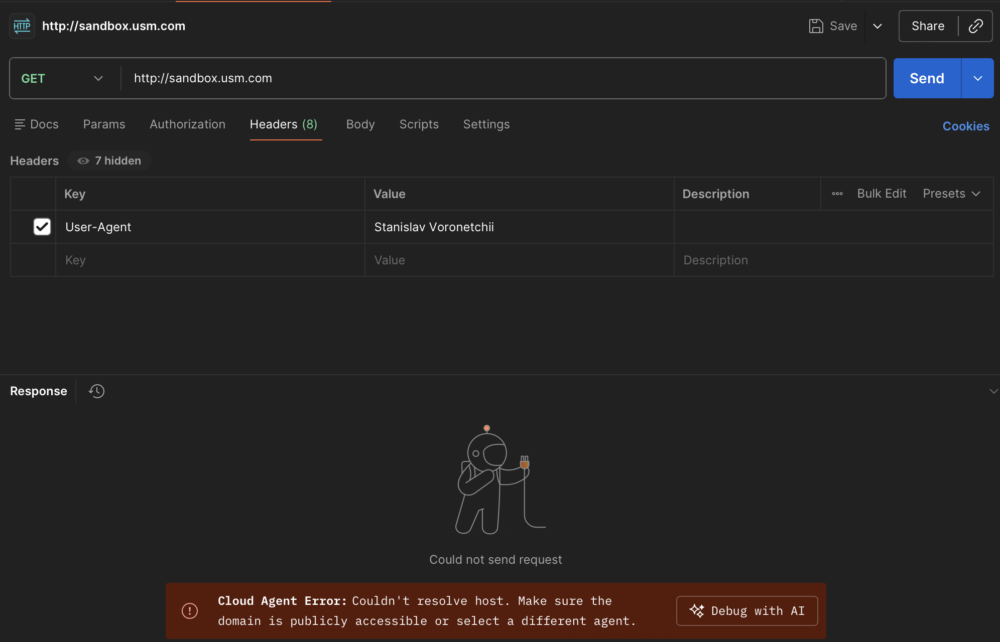
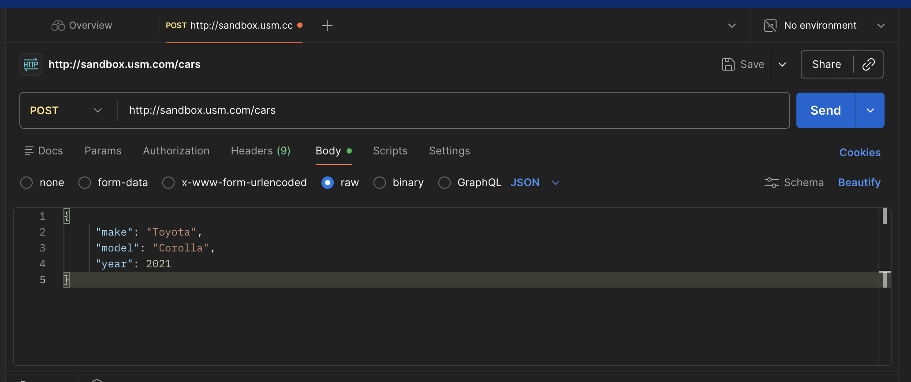
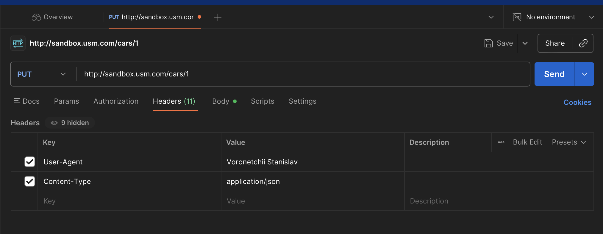
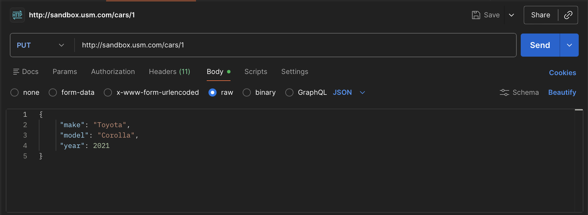

### Voronetchii Stanislav IA2404 USM

# Отчет по лабораторной работе №1: HTTP

## 1. Инструкции по запуску работы

Для повторения шагов нужны:

- Браузер
- DevTools -> вкладка `Network`
- Терминал с `curl` или PostMan (приложение или web версия)

Порядок выполнения:

1. Открыть нужный URL.
2. Включить DevTools (`F12`) -> `Network`.
3. Обновить страницу и выбрать интересующий HTTP-запрос.
4. Проанализировать `Headers`/`Payload`/`Response`.
5. Для ручных запросов использовать `curl`.

## 2. Описание лабораторной работы

Цель работы:

- Понять, что происходит, когда пользователь открывает сайт.
- Научиться находить и анализировать HTTP-запросы в браузере.
- Разобраться в назначении методов `GET`, `POST`, `PUT`, `DELETE`.

## 3. Краткая документация

- `GET` используется для получения ресурса (без изменения состояния сервера).
- `POST` используется для создания сущности или запуска серверной обработки.
- `PUT` используется для полной замены ресурса по известному URI.
- `PATCH` используется для частичного обновления ресурса.
- Коды ответа:
- `2xx` - успех.
- `4xx` - ошибка на стороне клиента.
- `5xx` - ошибка на стороне сервера.

## 4. Выполнение заданий

### Задание 1. Анализ HTTP-запросов (Wikipedia)

#### 4.1 Запрос к `https://en.wikipedia.org/wiki/HTTP`

- URL запроса: `https://en.wikipedia.org/wiki/HTTP`
- Метод запроса: `GET`
- Почему используется `GET`: страница запрашивается для чтения и отображения, без изменения данных на сервере.
- Статус ответа: `200 OK`
- Что означает статус: ресурс успешно найден и отдан клиенту.
- Заголовки ответа: `Accept-CH`, `Accept-Ranges`, `Age`, `Cache-Control`, `Content-Encoding: gzip`, `Content-Language: en`, `Content-Length`, `Content-Security-Policy-Report-Only`.
- Что содержат заголовки:
- параметры кеширования (`Cache-Control`, `Age`);
- способ кодирования (`Content-Encoding`);
- язык контента (`Content-Language`);
- размер тела (`Content-Length`);
- политика безопасности (`Content-Security-Policy-Report-Only`).
- Тело запроса для обычного `GET` отсутствует.
- Тело ответа: HTML-документ страницы Wikipedia + подгружаемые ресурсы.
- Какие еще запросы отправляются и почему:
  - После основного HTML браузер почти всегда грузит дополнительные ресурсы:

    CSS (стили) — чтобы страница выглядела правильно

    JS (скрипты) — интерактивность, меню, трекинг, модульные функции

    Images/SVG — иконки/логотипы

    Fonts — шрифты

    API/XHR/fetch — дополнительные данные (например, подсказки, модули)

Скриншот:



#### 4.2 Запрос к несуществующей странице `https://en.wikipedia.org/wiki/HTTPdsfdfs`

- URL запроса: `https://en.wikipedia.org/wiki/HTTPdsfdfs`
- Метод: `GET`
- Статус: `404 Not Found`
- Почему получен `404`: по указанному пути нет существующей статьи, сервер не нашел ресурс.
- Тело ответа: HTML-страница Wikipedia с сообщением об отсутствии статьи и вариантами действий (поиск, создание страницы и т.д.).

Скриншот:



### Задание 2. Анализ запроса поиска Wikipedia

Страница поиска: `https://en.wikipedia.org/w/index.php?search=&title=Special%3ASearch`, запрос по слову `browser`.

- URL поиска: `https://en.wikipedia.org/w/index.php?search=browser&title=Special%3ASearch&profile=advanced&fulltext=1&advancedSearch-current=...&ns0=1&wprov=acrw1_-1`

- Метод: `GET`
  - Почему `GET`: операция поиска не изменяет данные сервера, а параметры удобно передаются в URL (можно повторно открыть/поделиться ссылкой).

- Query Parameters (основные):
  - `search=browser` - поисковая строка
  - `title=Special:Search` - служебная страница поиска MediaWiki
  - `profile=advanced` - профиль расширенного поиска
  - `fulltext=1` - поиск по полному тексту
  - `advancedSearch-current=...` - сериализованные параметры расширенного фильтра
  - `ns0=1` - ограничение по пространству имен (основные статьи)
  - `wprov=...` - служебный параметр источника/контекста запроса



### Задание 3. Анализ HTTP-запроса для сайта на выбор (Google)

Выбран сайт: `https://www.google.com`

- URL: `https://www.google.com/`
- Метод: `GET`
- Статус: `200 OK`
- Главная страница успешно отдана
- Дополнительно по заголовкам ответа видно использование client hints (`Accept-CH`) и других параметров оптимизации



### Задание 4. Составление HTTP-запросов (`curl`)

`User-Agent` в примерах указан как `Ivan Ivanov`.

#### 4.1 GET-запрос с `User-Agent`

```bash
curl -i -X GET "http://sandbox.usm.com" \
  -H "User-Agent: Stanislav Voronetchii"
```

или



Ответа нет, sandbox.usm.com - не отвечает :)

Что такое `User-Agent` и зачем используется:

- Это строка-идентификатор клиента (браузер/приложение/скрипт)
- Используется сервером для аналитики, журналирования, адаптации ответов и отладки

#### 4.2 POST-запрос `/cars`

```bash
curl -i -X POST "http://sandbox.usm.com/cars" \
  -H "Content-Type: application/x-www-form-urlencoded" \
  -d "make=Toyota&model=Corolla&year=2020"
```

или



Какие еще методы HTTP существуют и для чего:

- Основные методы:
  - GET — получить данные
  - POST — создать новый ресурс
  - PUT — полностью заменить существующий ресурс
  - PATCH — частично обновить ресурс
  - DELETE — удалить ресурс
  - HEAD — получить только заголовки ответа
- Другие:
  - `OPTIONS` - узнать поддерживаемые методы/опции ресурса.
  - `CONNECT` - установить туннель (обычно для TLS через прокси).
  - `TRACE` - диагностический возврат запроса (редко используется, часто отключен).

#### 4.3 PUT-запрос `/cars/1`

```bash
curl -i -X PUT "http://sandbox.usm.com/cars/1" \
  -H "User-Agent: Ivan Ivanov" \
  -H "Content-Type: application/json" \
  -d '{"make":"Toyota","model":"Corolla","year":2021}'
```

или

Заголовки:


Тело запроса:


Разница между `PATCH` и `PUT`:

- `PUT` обычно передает полное новое представление ресурса (полная замена).
- `PATCH` передает только изменения (частичное обновление).

#### 4.4 Возможный ответ сервера на `POST /cars`

Один из возможных корректных вариантов:

```http
HTTP/1.1 201 Created
Content-Type: application/json
Location: /cars/123

{
  "id": 123,
  "make": "Toyota",
  "model": "Corolla",
  "year": 2020
}
```

Когда возможны коды:

- `200 OK` - запрос обработан успешно, сервер вернул результат без создания новой сущности.
- `201 Created` - новая запись автомобиля успешно создана.
- `400 Bad Request` - невалидные параметры (например, пустой `model`, некорректный `year`).
- `401 Unauthorized` - требуется аутентификация, но клиент не предоставил валидные учетные данные.
- `403 Forbidden` - клиент аутентифицирован, но нет прав на создание/изменение ресурса.
- `404 Not Found` - запрошенный endpoint или ресурс не существует.
- `500 Internal Server Error` - внутренняя ошибка сервера при обработке запроса.

## 5. Ответы на контрольные вопросы

1. Почему для загрузки страницы используется `GET`?
Ответ: потому что клиент только получает представление ресурса, не изменяя состояние сервера

2. Что означает `200 OK`?
Ответ: сервер успешно обработал запрос и вернул ресурс

3. Что означает `404 Not Found`?
Ответ: по указанному URI ресурс не найден

4. Что содержат HTTP-заголовки?
Ответ: метаданные запроса/ответа (тип и размер контента, кеширование, язык, безопасность, клиентские характеристики и тд)

5. Есть ли тело у `GET`-запроса?
Ответ: обычно нет, данные передаются в URL, а основное тело приходит в ответе

6. Почему для поиска по Wikipedia используется `GET`?
Ответ: поиск является операцией чтения, а параметры удобно передавать в URL для повторяемости и шаринга ссылки

7. Что такое `User-Agent`?
Ответ: строка, идентифицирующая клиент, его платформу/версию и тип приложения

8. Какие основные HTTP-методы используются в API?
Ответ: `GET`, `POST`, `PUT`, `PATCH`, `DELETE`, а также служебные `HEAD`, `OPTIONS`

9. В чем отличие `PUT` и `PATCH`?
Ответ: `PUT` - полная замена ресурса, `PATCH` - частичное изменение

## 6. Использованные источники

- Wikipedia: HTTP - https://ru.wikipedia.org/wiki/HTTP

- Developer Mozilla: HTTP - https://developer.mozilla.org/ru/docs/Web/HTTP/Reference/Methods

- Habr: HTTP - https://habr.com/ru/articles/865040/

## 7. Дополнительные важные аспекты

- Для сравнения поведения полезно проверять запросы в режиме `Disable cache`