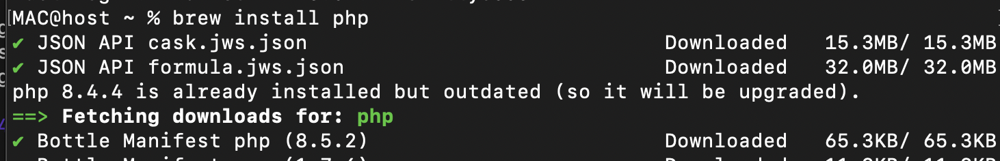

### Voronetchii Stanislav IA2404 USM

# Лабораторная работа №2. Установка и первая программа на PHP

## Описание лабораторной работы
В рамках работы была настроена среда для PHP и создана первая программа с выводом текста и переменных.

Выполненные шаги:
- установка и проверка PHP;
- создание файла `index.php`;
- вывод строк через `echo` и `print`;
- работа с переменными `$days` и `$message`;
- вывод значений через конкатенацию и через двойные кавычки с переносом строки `<br />`.

## Инструкции по запуску проекта
1. Открыть терминал в каталоге проекта:
   ```bash
   cd /Users/MAC/VSC/php_labs/lab02
   ```
2. Запустить встроенный веб-сервер PHP:
   ```bash
   php -S localhost:8080
   ```
3. Открыть в браузере:
   `http://localhost:8080/`

## Краткая документация к проекту
- Точка входа: `index.php`.
- Переменные:
  - `$days = 288` (int);
  - `$message = "Все возвращаются на работу!"` (string).
- Вывод реализован двумя способами:
  - конкатенация через оператор `.`;
  - интерполяция переменных в строке с двойными кавычками.

## Примеры использования проекта
Фрагмент кода из `index.php`:

```php

$days = 288;
$message = "Все возвращаются на работу!";

echo "Конкатенация: " . $days . " дней. " . $message . "<br />";
echo "Двойные кавычки: Через $days дней $message<br />";
```

Результат запуска и проверка окружения:


Установка PHP в терминале


Результат работы программы в браузере

## Ответы на контрольные вопросы
1. Какие способы установки PHP существуют?  
   Основные варианты: ручная установка с официального сайта `php.net` (скачивание и настройка `Path`) и установка через готовые сборки, например XAMPP.

2. Как проверить, что PHP установлен и работает?  
   Выполнить в терминале команду `php -v`. Если отображается версия PHP, интерпретатор установлен корректно.

3. Чем отличается оператор `echo` от `print`?  
   `echo` выводит одну или несколько строк и не возвращает значение, обычно немного быстрее.  
   `print` выводит одну строку и возвращает `1`, поэтому может использоваться в выражениях.

## Список использованных источников
1. PHP Manual (RU), установка в Windows: https://www.php.net/manual/ru/install.windows.manual.php  
2. PHP Manual (RU), `echo`: https://www.php.net/manual/ru/function.echo.php  
3. PHP Manual (RU), `print`: https://www.php.net/manual/ru/function.print.php  
4. Apache Friends (RU), загрузка XAMPP: https://www.apachefriends.org/ru/download.html   
5. Metanit, руководство по PHP: https://metanit.com/php/tutorial/

## Дополнительные важные аспекты
- Встроенный сервер PHP запускается из текущей папки, поэтому файл `index.php` должен находиться в выбранной дирректории
- Если сервер запущен из другой директории, нужно указать корень явно:  
  `php -S localhost:8080 -t /Users/MAC/VSC/php_labs/lab02`
