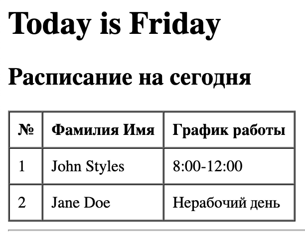
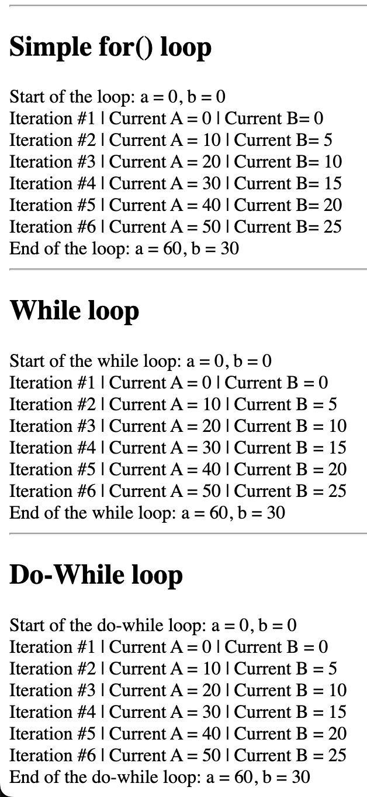

# Лабораторная работа №3. Управляющие конструкции

### Voronetchii Stanislav IA2404 USM

## Цель работы

Освоить использование условных конструкций и циклов в PHP.

## Описание лабораторной работы

В работе реализованы две части:

1. Условные конструкции: формирование таблицы расписания сотрудников в зависимости от текущего дня недели.
2. Циклы: вывод промежуточных и итоговых значений переменных `$a` и `$b` в циклах `for`, `while`, `do-while`.

## Инструкции по запуску проекта

1. Перейти в папку проекта:

```bash
cd /Users/MAC/VSC/php_labs/lab03
```

2. Запустить встроенный сервер PHP:

```bash
php -S localhost:8000
```

3. Открыть в браузере:

```text
http://localhost:8000
```

## Краткая документация к проекту

- Текущий день недели определяется через `date('N')`, где:
  - `1` — понедельник, `7` — воскресенье, остальные дни недели соответственно
  - Через `switch ($day)` формируется текстовое название дня недели.
- Для формирования графика сотрудников используются проверки `in_array(...)`:
- `John Styles` работает в `1, 3, 5` дни (`8:00-12:00`).
- `Jane Doe` работает в `2, 4, 6` дни (`12:00-16:00`).
- В блоках циклов выводится стартовое состояние, промежуточные значения на каждой итерации и финальный результат.

## Примеры использования

### 1. Условные конструкции и таблица расписания

Ключевой фрагмент:

```php
$day = date('N');

switch ($day) {
    case 1: $dayName = 'Monday'; break;
    case 2: $dayName = 'Tuesday'; break;
    case 3: $dayName = 'Wednesday'; break;
    case 4: $dayName = 'Thursday'; break;
    case 5: $dayName = 'Friday'; break;
    case 6: $dayName = 'Saturday'; break;
    case 7: $dayName = 'Sunday'; break;
    default: $dayName = 'Unknown';
}

$johnSchedule = in_array($day, [1, 3, 5]) ? '8:00-12:00' : 'Нерабочий день';
$janeSchedule = in_array($day, [2, 4, 6]) ? '12:00-16:00' : 'Нерабочий день';
```

Скриншот результата:



### 2. Циклы `for`, `while`, `do-while`

Ключевой фрагмент (`for`):

```php
$a = 0;
$b = 0;

for ($i = 0; $i <= 5; $i++) {
    echo "Iteration #" . ($i + 1) . " | Current A = $a | Current B = $b<br>";
    $a += 10;
    $b += 5;
}

echo "End of the loop: a = $a, b = $b";
```

Аналогичная логика реализована для `while` и `do-while` с выводом промежуточных значений.

Скриншот результата:



## Ответы на контрольные вопросы

1. В чем разница между `for`, `while`, `do-while` и когда использовать каждый?

- `for`: удобен, когда заранее известны инициализация, условие остановки и шаг изменения счетчика.
- `while`: применяется, когда важна проверка условия перед каждой итерацией и число итераций заранее неизвестно.
- `do-while`: гарантирует минимум одну итерацию, потому что условие проверяется после выполнения тела цикла.

2. Как работает тернарный оператор `? :` в PHP?

- В целом работает как и в других языках
  - Тернарный оператор — сокращенная форма `if/else`
  - Формат: `условие ? значение_если_истина : значение_если_ложь`
- В этой работе он применен для выбора графика сотрудника в зависимости от дня недели

3. Что произойдет, если в `do-while` поставить условие, которое изначально ложно?

- Тело цикла выполнится один раз, после чего условие проверится и цикл завершится.

## Список использованных источников

1. Metanit: учебник по PHP — https://metanit.com/php/tutorial/  
2. PHP.SU: справочник и учебные материалы по PHP — https://www.php.su/  
3. Habr: раздел PHP (статьи и разборы) — https://habr.com/ru/hub/php/  
4. Proglib: материалы и статьи по PHP — https://proglib.io/tags/php  

## Дополнительные важные аспекты

- Все задания лабораторной выполнены в одном файле `index.php`
- Логику вывода и стиль можно дополнительно улучшить, вынеся HTML разметку в шаблон и добавив CSS стили для страницы и таблицы
